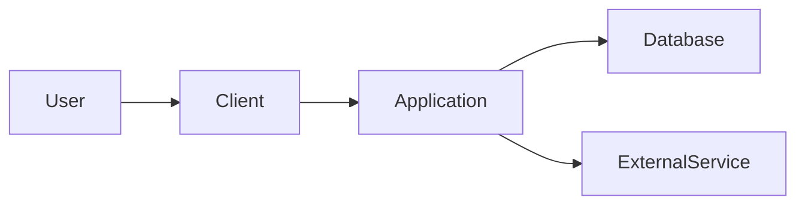

# Architecture overview

## System context

[Describe users, upstream systems, downstream systems, and trust boundaries.]

## Runtime components

For each component document:

- Responsibility
- Owned data
- Public interfaces
- Dependencies
- Scaling model
- Failure behavior
- Deployment unit
- Operational owner

## Authentication and authorization

[Describe identity provider, session or token model, authorization enforcement points, tenant boundaries, and audit requirements.]

## Data flow

[Describe important synchronous, asynchronous, and batch flows.]

## Deployment topology

[Describe environments, regions, network boundaries, and external services.]

## Reliability model

[Describe critical dependencies, graceful degradation, retry and timeout strategy, and recovery objectives.]
